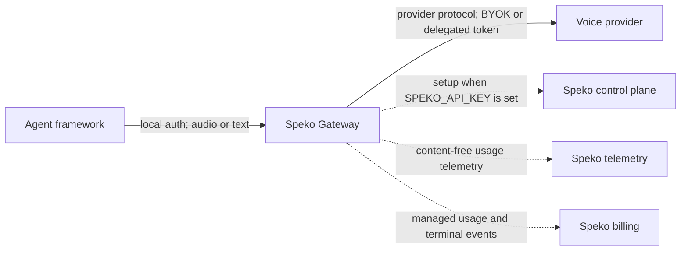

# Trust and data flow

This document describes what Speko Gateway can access, where it sends data,
and what changes when `SPEKO_API_KEY` is configured.

## Boundaries

The local API is served on an owner-only Unix socket and still requires a
local bearer token. Health and readiness are the only unauthenticated routes.
The container exposes no TCP port.

Provider media and text flow directly between the agent process, this gateway,
and the selected provider. They are not proxied through Speko when the route is
`provider_direct`.

## BYOK without a Speko key

When `SPEKO_API_KEY` is absent:

- Plans are generated and HMAC-signed in process.
- A request must choose BYOK, provider-direct routing, and forbid relay.
- The BYOK provider key is injected into an ephemeral adapter request only
  after the local plan has been verified.
- No control-plane plan, fallback, or lease request is made.
- Content-free usage telemetry is sent anonymously unless explicitly disabled.

Only the configured provider sees media/text and its own API key. Anonymous
telemetry carries no Speko API key, account identifier, provider credential,
or stable installation identifier. As with any HTTP request, the receiving
server can observe transport metadata such as the source IP address.

## With a Speko key

Setting `SPEKO_API_KEY` enables setup calls to the Speko control plane. The
gateway sends a provider-neutral session request containing:

- session kind and protocol revision;
- gateway version, instance identifier, installed adapters, and route support;
- optional integration/framework name and versions;
- route and credential-source constraints;
- requested provider, model, voice, language, region, allow/deny constraints,
  maximum TTS characters, and `objective` when supplied; and
- media encoding, sample rate, and channel count.

Do not put prompts, transcripts, or user content in `objective`; it is setup
metadata and is sent to Speko when an API key is configured.

Speko returns a signed, short-lived session plan. The gateway validates its
structure, time bounds, issuer, audience, signature, provider endpoint, and
adapter before it accepts media or attaches credentials.

### Prefetched plans

By default the gateway fetches plans **ahead of demand** and holds a small pool
of them in memory, so that opening a session costs no control-plane round trip.
This is a deliberate change to what the process holds, and it is worth stating
plainly:

- The gateway keeps up to `SPEKO_WARM_PLAN_TARGET` unused signed plans per route
  shape (default 4), each carrying a short-lived delegated provider credential
  and a session-scoped telemetry token.
- Those credentials exist in process memory from the moment they are fetched
  rather than from the moment a session starts — a longer window than
  mint-on-demand, bounded by the plan lifetime (5 minutes by default) and the
  pool size.
- Every plan is validated and its `jti` consumed exactly once before any media
  is accepted, exactly as a synchronously fetched plan is. Prefetching changes
  when a plan arrives, not what is checked.
- Unused plans are discarded at expiry and settle at zero.

Set `SPEKO_WARM_PLAN_TARGET=0` to disable prefetching and fetch every plan at
session-create time. Sessions then pay a control-plane round trip before the
provider socket opens.

### Relay plans (revision 4)

The Global Speko Relay uses a second, deliberately isolated plan family.
Relay plans are compact JWS with protected-header typ
`speko.relay-plan+jws` and audience `speko-relay`, signed by a dedicated
control-plane key published on a dedicated JWKS document
(`/.well-known/relay-jwks.json`) with its own kid — never the session-plan
key or kid, so neither plan family's signature can ever authorize the
other's consumer. The relay CONNECTOR (Speko-hosted, one process per
provider) is the sole verifier and the sole consumer of a relay plan's
single-use JTI; it consumes the JTI only after its region/provider/model/
endpoint self-checks pass, dials providers exclusively at the embedded
catalog's endpoint (the plan endpoint is an assertion to compare), and
reads its one provider secret only after full verification. This
repository contributes the verifier (`runtime.RelayPlanVerifier`), the
relay-route adapter arms (credential kind `relay_access` alongside
`bearer`; BYOK unchanged), and the public `relayapi` wire contract.

When a session requests BYOK, the provider key remains in gateway memory and
is not sent in the setup request. When it requests managed credentials, the
plan carries a short-lived provider-specific credential. The permanent
`SPEKO_API_KEY` is used only for control-plane plan/fallback calls and is never
sent to a provider.
Fallback calls are restricted to the configured control-plane origin, even
when a signed plan contains the exchange path.

The selected provider receives the requested model/media options and its
authentication material. On managed Deepgram STT routes it also receives the
opaque Speko reservation ID in Deepgram's `extra` field so provider usage can
be correlated with the consolidated bill. It receives no Speko API key.

## Telemetry and billing

Content-free usage telemetry is on by default for every gateway installation.
When no Speko API key is configured, events use an unauthenticated Speko
destination and are not associated with an account. Plans issued after Speko
authentication carry a session-scoped destination and token.

The gateway can export:

| Event | Content-free payload |
| --- | --- |
| `session.opened` | provider connection latency in milliseconds |
| `agent.event` | canonical event type and sequence number |
| `lease.renewed` | renewal sequence and expiry timestamp |
| `usage.observed` | provider request correlation ID |
| `usage.reported` | accepted character or complete-PCM duration quantity in thousandths of the declared unit |
| `session.closed` | no payload |
| `error` | error class, source, retryability, and provider HTTP status |

Canonical timing markers include speech start/end, final transcript, response
start/done/cancel, text done, tool call, and audio start/done. The markers make
latency analysis framework-independent; they do not copy the associated
content.

The exporter code deliberately excludes:

- audio frames;
- transcript text;
- prompts or generated text;
- tool names, arguments, and results;
- provider extensions or response payloads; and
- Speko or provider credential values.

Setting `SPEKO_TELEMETRY_DISABLED=true` suppresses anonymous and optional
events. On a managed-credential route, the gateway still exports
`usage.reported`, `usage.observed`, and the terminal `session.closed` or `error`
event because those records are required to meter and consolidate the provider
charge. BYOK routes have no mandatory billing records.

Managed billing is post-paid: nothing is authorized before a session starts, and
usage is settled monthly from these records afterwards. Two things follow.
`lease.renewed` no longer occurs on a managed provider-direct route — the
session lease is a ceiling the gateway enforces locally, with no mid-call
control-plane call — and a lost `usage.reported` now results in that usage not
being billed rather than in a fallback charge.

Anonymous BYOK events are sent without an authorization header to
`https://gateway.speko.dev/v1/anonymous-runtime-events`. The receiver rejects
unknown event fields and keeps these events in storage with no organization,
API key, plan, reservation, or billing association. Managed plan telemetry is
sent separately to the authenticated endpoint supplied in the signed plan.

Telemetry delivery is asynchronous, bounded, and never blocks audio or text.
Events can be dropped under pressure or after bounded retries; counters expose
that condition without recording customer content.

## Credential handling

- Secrets may come from environment variables or owner-managed files.
- Secret values are never intentionally logged.
- BYOK keys are copied only after plan verification and retained in process
  memory for reuse; plans and sessions retain no copy.
- Connected session-plan credentials and telemetry tokens are short-lived and
  scoped by the Speko control plane. Anonymous telemetry has no token.
- Provider URLs cannot contain user info, query strings, or fragments before
  the adapter constructs the request.
- Production provider WebSockets must use `wss`, the provider's exact allowed
  host, and port 443.

The adapter handshakes follow the providers' public contracts: [Deepgram
streaming STT](https://developers.deepgram.com/reference/speech-to-text/listen-streaming),
[ElevenLabs multi-context
TTS](https://elevenlabs.io/docs/api-reference/text-to-speech/v-1-text-to-speech-voice-id-multi-stream-input/),
and [Cartesia WebSocket
TTS](https://docs.cartesia.ai/api-reference/tts/websocket), plus [Cartesia
manual-finalize STT](https://docs.cartesia.ai/api-reference/stt/websocket).
Provider-specific
authentication is visible in the corresponding adapter source and tests.

Environment variables may be visible through container or host inspection.
Use the `_FILE` variants and a secrets manager in production.

## Non-goals and current limits

- This repository does not contain Speko's hosted control plane or billing
  implementation, nor the hosted relay services themselves — it publishes
  the relay's wire contract (`relayapi`), protocol types, verifier, and
  adapter relay arms that those hosted services import.
- The local gateway image serves provider-direct routes; sending traffic
  through the hosted Speko relay is a hosted-service surface
  (`relay.speko.dev`) with its own contract in `relayapi`.
- Content-free timing events are an observability foundation, not distributed
  tracing across every application component. Framework adapters can add more
  canonical stages without moving raw content into telemetry.
- Process memory is not a hardware security boundary. Run the image with least
  privilege, a read-only filesystem, and a dedicated workload identity.
